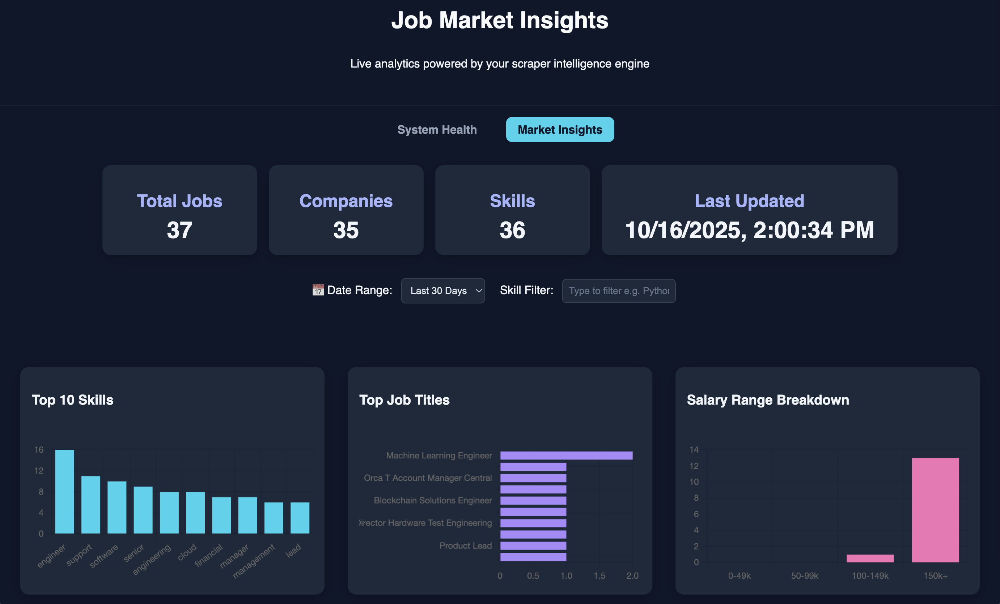
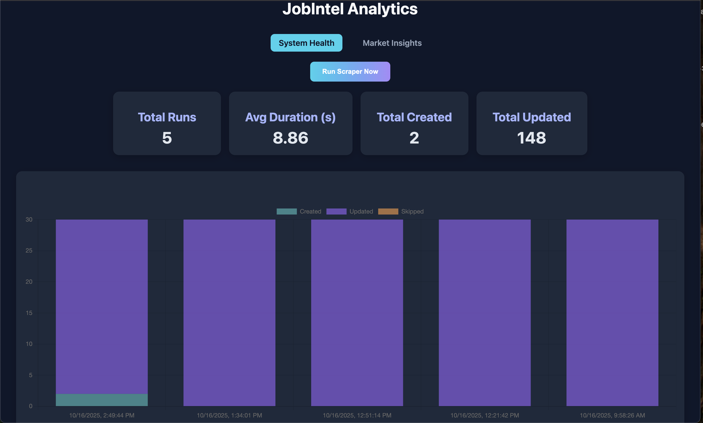

<a name="readme-top"></a>

<div align="center">
  
  <h1 align="center">JobIntel<br/>The Intelligent Job Market Insights API</h1>
</div>

<div align="center">
  <a href="https://github.com/E-ugine/JobIntel"></a>
  <a href="https://railway.app/"></a>
  <a href="https://www.postgresql.org/"></a>
  <a href="https://fastapi.tiangolo.com/"></a>
  <a href="https://redis.io/"></a>
  <a href="https://www.docker.com/"></a>
  <hr>
</div>

---

## Overview

**JobIntel** is an intelligent system that continuously scrapes, cleans, and visualizes job market trends in real time.  
It empowers researchers, hiring teams, and career platforms with live insights into the ever-evolving tech landscape.

> _Transform messy job listings into clean, queryable intelligence — fully automated._

### ✨ Key Features

- **Automated Job Scraper** — Collects listings from [RemoteOK](https://remoteok.com) and [WeWorkRemotely](https://weworkremotely.com) via Playwright.  
- **Data Normalization Engine** — Cleans and structures raw data for analysis.  
- **Real-Time Analytics** — Tracks skills, salaries, and hiring trends.  
- **Asynchronous Processing** — Celery workers + Redis broker for fast, non-blocking jobs.  
- **Self-Updating System** — Beat scheduler automates scraping cycles.  
- **Dockerized Stack** — One command spins up API, Worker, Beat, Postgres, and Redis.  
- **Interactive Dashboards** — Explore top skills, salaries, and hiring velocity in real time.

---

## Architecture

| Layer           | Description                                   |
|-----------------|-----------------------------------------------|
| **FastAPI**     | REST API & dashboards                         |
| **Celery Worker** | Handles async scraping & ingestion            |
| **Celery Beat** | Schedules scraping cycles                     |
| **Redis (RedBeat)** | Message broker & persistent Beat scheduler   |
| **PostgreSQL**  | Stores structured job data                    |
| **Docker Compose** | Orchestrates all services locally & in cloud  |

---

## Tech Stack

| Category | Tools |
|-----------|-------|
| **Backend** | FastAPI, SQLAlchemy, Alembic |
| **Async Tasks** | Celery, Redis, RedBeat |
| **Scraping** | Playwright |
| **Database** | PostgreSQL |
| **Infra** | Docker, Railway |
| **Frontend (Dashboards)** | Jinja2, Chart.js, Tailwind CSS |

---

## ⚡ Quick Start (Dockerized)

### Prerequisites
- Docker & Docker Compose installed  
- Git  
- Internet connection (Playwright needs Chromium drivers)

### 1️⃣ Clone the Repo
```bash
git clone https://github.com/E-ugine/JobIntel.git
cd JobIntel

2️⃣ Configure Environment

Create a .env file:

DATABASE_URL=postgresql://postgres:postgres@db:5432/jobintel
REDIS_URL=redis://redis:6379/0
SECRET_KEY=your-secret-key
ENV=dev

3️⃣ Build & Run
docker compose up --build


Runs migrations

Launches API, Worker, Beat, DB, and Redis

Access the API: http://localhost:8000
Check docs: http://localhost:8000/docs
Acess dashboard: http://localhost:8000/dashbord
Acess insights: http://localhost:8000/insights

4️⃣ Trigger a Scrape from the dahsbord

5️⃣ Access Dashboards
URL	Description
/dashboard	Monitor scrape jobs & system performance
/insights	Visualize top skills, salaries, and job titles

Deployment (Railway):
Create a new Railway project → “Deploy from GitHub”

Add PostgreSQL and Redis plugins

Configure three services:
Service	Command
API	bash -c "python -m alembic upgrade head && uvicorn app.main:app --host 0.0.0.0 --port ${PORT:-8000}"
Worker	celery -A app.core.celery_app.celery worker --loglevel=info
Beat	celery -A app.core.celery_app.celery beat --loglevel=info

Map Environment Variables:

DATABASE_URL → from Railway Postgres

REDIS_URL → from Railway Redis

SECRET_KEY → set manually

✅Done — JobIntel now self-updates live on the cloud.

##API Endpoints

| Endpoint | Method | Description |
|-----------|---------|-------------|
| `/api/scrape` | **POST** | Trigger a new scrape cycle |
| `/api/jobs` | **GET** | Fetch all job listings |
| `/api/insights` | **GET** | View analytics summary (top skills, salary trends, titles) |
| `/api/stats` | **GET** | Retrieve scrape statistics and run metadata |
| `/api/health` | **GET** | Check API health and connectivity status |

---

###Example Response — `/api/insights`

```json
{
  "top_skills": ["Python", "React", "AWS"],
  "avg_salary_usd": 96000,
  "trending_titles": ["Data Engineer", "Backend Developer"]
}


Troubleshooting
Issue	Fix
Playwright executable missing	Update Docker base image → mcr.microsoft.com/playwright/python:v1.55.0-jammy
UndefinedTable “jobs”	Run migrations → alembic upgrade head
Beat not scheduling	Ensure RedBeat is enabled in celery_app.py
Worker silent	Verify Redis connection & Celery import paths

Roadmap:
Add more job boards (LinkedIn, Wellfound, AngelList)
ML-powered skill clustering
Historical salary trend visualization
Token-based API authentication
Deploy full frontend dashboard
Integration tests & CI/CD pipeline

🖼️ Demo (Preview)
Insights Dashboard	Scrape Monitor
	


🤝 Contributing

We welcome contributions — JobIntel thrives on open collaboration.
Fork the repo
Create your feature branch (git checkout -b feature/awesome-idea)
Commit changes (git commit -m 'Add awesome feature')
Push to branch (git push origin feature/awesome-idea)
Open a Pull Request

Suggestions, bug fixes, and new data sources are always appreciated.

Testing:
Coming soon


Coverage reports coming soon.

License

Distributed under the MIT License.
See LICENSE
 for more information.

Acknowledgements

This project stands on the shoulders of open-source excellence:
FastAPI, Celery, Redis, SQLAlchemy, Docker, and Playwright — the pillars of modern backend automation.

Built with ❤️ by Eugine Agolla
📧 agollaeugine@gmail.com

⬆️ Back to top